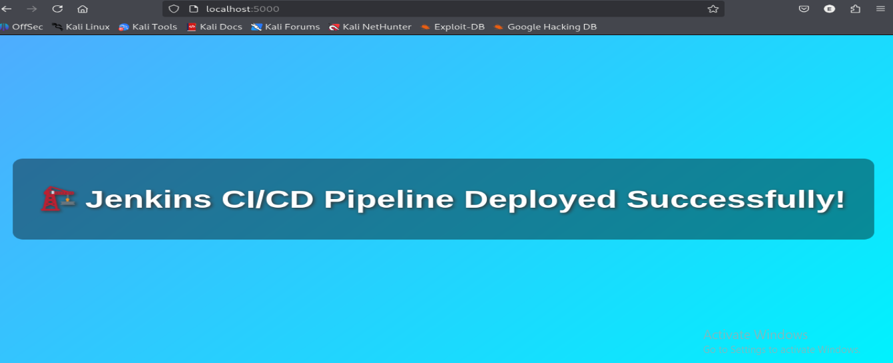
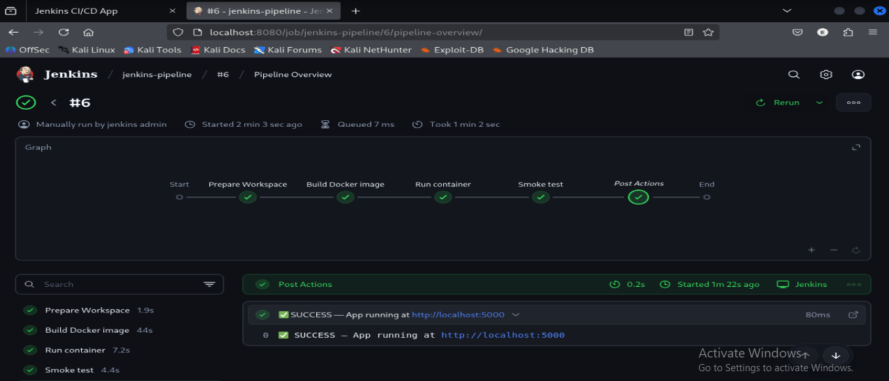

# 🚀 Jenkins CI/CD Pipeline Demo

This repository demonstrates a simple **CI/CD pipeline** using Jenkins.

---

## 📝 Project Overview

| File | Description |
|------|-------------|
| 🐍 **app.py** |  Web application (Flask or similar) |
| 📦 **Dockerfile** |  Build instructions |
| 📜 **requirements.txt** | Python dependencies |
| 🔧 **Jenkinsfile** |  Pipeline configuration |

---

## 📂 Step-by-Step Setup

1. 🐍 **Create `app.py`** → simple Flask app  
2. 📜 **Add `requirements.txt`** → list dependencies (`Flask`)  
3. 📦 **Create `Dockerfile`** → define build process  
4. 🛠 **Build Docker Image**  
   ```bash
   docker build -t myapp .

---
### ✅ App Running


### 🌐 Browser Output (5000 port)
.png)

### 🌐 Browser Output (9090 port)
.png)

### 🚀 Pipeline Success


